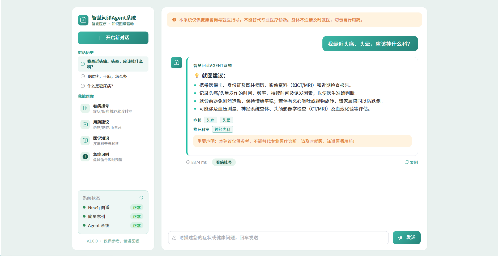

# 智慧问诊 Agent 系统

一套「**领域知识 + 安全问答**」的端到端智慧问诊 Agent 系统。

## 项目一句话

爬取医疗数据 → 大模型抽取实体关系建知识图谱 → 向量 + 图谱双路混合检索（GraphRAG）→ LangGraph 多 Agent 协作问答 → FastAPI + Vue3 流式前端。回答强制绑定检索证据，并叠加确定性安全规则（免责声明 / 急症预警 / 用药提醒）。

## 界面预览



## 技术栈

| 层 | 技术 |
|---|---|
| 数据层 | Neo4j 5.26（8 类节点 / 12 类关系）、FAISS（IndexIVFFlat）、BGE-M3 |
| 智能体层 | LangChain 0.1.x + LangGraph 0.0.x |
| 大模型 | OpenAI 兼容接口（默认 DeepSeek；`.env` 一行切换本地 vLLM） |
| 会话存储 | Redis 热缓存（最近 12 轮 / TTL 24h）；MySQL 全量持久化（P4） |
| API 层 | FastAPI + SSE 流式输出 |
| 前端层 | Vue3 + Vite + Element Plus（axios 统一请求封装 + Vite 代理） |
| 基础设施 | docker-compose（Neo4j / Redis / MySQL） |

## 已实现功能（截至 P2）

- **核心对话**：SSE 流式逐字输出、多轮上下文、回车发送、自动滚动到底
- **真实 LLM**：接入大模型（DeepSeek），回答简洁要点化、**不使用 emoji**
- **会话历史**：Redis 热缓存（最近 12 轮 / TTL 24h）、左栏列表、点击切换复原、删除会话
- **医疗安全层**：确定性规则引擎 —— 所有回答强制附带免责声明；用药类问题追加用药提醒
- **医疗 UI**：免责警示条、响应耗时、一键复制、症状标签 / 推荐科室（结构就绪，数据待 P3）

## 目录结构

```
smart-medical-consultation/
├── backend/
│   ├── app/
│   │   ├── api/            # 接口层：system(/health)、chat、sessions
│   │   ├── services/       # 业务服务：llm（大模型调用）、safety（安全规则）
│   │   ├── store/          # 数据访问：session_store（Redis 会话缓存）
│   │   ├── agent/          # LangGraph 多 Agent 编排（P3）
│   │   └── retrieval/      # 向量 / 图谱 / GraphRAG 检索（P3）
│   └── main.py             # 入口：CORS + 路由挂载
├── frontend/               # Vue3 + Vite + Element Plus
│   └── src/{api,utils}/    # 接口集中管理 + axios 统一请求封装
├── docker-compose.yml      # Neo4j(7474/7687) / MySQL(3307) / Redis(6379)
└── requirements.txt        # 后端锁定依赖
```

## 接口（已实现）

| 方法与路径 | 说明 |
|---|---|
| `GET /health` | 健康检查 |
| `POST /api/chat` | 发送对话（非流式） |
| `POST /api/chat/stream` | 发送对话（SSE 流式） |
| `GET /api/chat/messages` | 会话消息列表 |
| `GET /api/sessions` | 会话列表 |
| `DELETE /api/sessions/{sessionId}` | 删除会话 |

## 快速开始

### 1. 启动基础中间件
```bash
docker compose up -d        # 启动 Neo4j / MySQL(3307) / Redis
```

### 2. 配置后端
```bash
cp .env.example .env         # 复制并填写 LLM_API_KEY（本仓库 .env 不入库）
# Python 3.12 虚拟环境
python -m venv .venv && .venv\Scripts\activate
pip install -r requirements.txt
cd backend
python main.py               # 服务运行在 http://127.0.0.1:8000
```

> 健康检查：`GET http://127.0.0.1:8000/health`

### 3. 启动前端
```bash
cd frontend
npm install
npm run dev                  # 运行在 http://localhost:5173
```

## 里程碑

- [x] P0 项目骨架搭建（前端 Vue3 + 后端 FastAPI + /health）
- [x] P1 核心对话交互（消息收发 + SSE 流式）              ← P1-1 ~ P1-5
- [x] P2 业务功能完善（真实 LLM、会话缓存、安全规则）      ← P2-1 ~ P2-5 + 会话删除
- [ ] P3 核心技术壁垒（GraphRAG 混合检索 + 多 Agent 编排）
- [ ] P4 工程化收尾（MySQL 持久化、评估门禁、微调、一键部署）

*本系统仅供健康咨询与就医指导，不能替代专业医疗诊断。身体不适请及时就医，切勿自行用药。*
